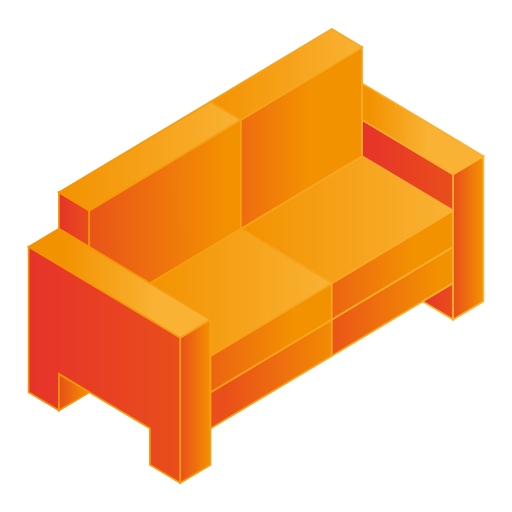

<h1 align="center">Comfy</h1>
<div align="center">
	
</div>

## Introduction

Comfy is a Wayland compositor written in the Rust programming language and inspired by i3wm, bspwm and XMonad. It's main goal is ease of use, extensibility and a sane codebase.

## Getting Started

These instructions will get you a copy of the project up and running on your local machine for development and testing purposes. See deployment for notes on how to deploy the project on a live system.

### Prerequisites

What things you need to install the software and how to install them

```
Give examples
```

### Installing

A step by step series of examples that tell you how to get a development env running

Say what the step will be

```
Give the example
```

And repeat

```
until finished
```

End with an example of getting some data out of the system or using it for a little demo

## Running the tests

Run the following command:

### All test:

```
cargo test
```

### A specific test:

```
cargo test <name of the test>
```

## Deployment

Add additional notes about how to deploy this on a live system

### Using Cargo

```
cargo install comfywm
```

### Built With

* [Rust](https://www.rust-lang.org) - System programming language
* [wlroots-rs](https://github.com/swaywm/wlroots-rs) - Safe Rust bindings for wlroots.

## Contributing

Please read [contributing](CONTRIBUTING.md) for details on our code of conduct, and the process for submitting pull requests to us.

## Versioning

We use [SemVer](http://semver.org/) for versioning.

## Authors

* **Daniel-Junior Dubé** - *Initial work* - [Github](https://github.com/daniel-junior-dube), [Portfolio](https://daniel-junior-dube.github.io)
* **Félix Chabot** - *Initial work* - [Github](https://github.com/chabam)

See also the list of [contributors](CONTRIBUTORS.md) who participated in this project.

## License

This project is licensed under the MIT License - see the [license](LICENSE.md) file for details

## Acknowledgments

* Hat tip to anyone whose code was used
* Inspiration
* etc
